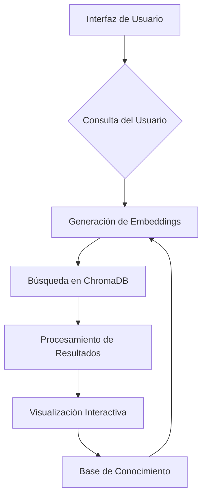

# 🧠 Enterprise Knowledge Manager (EKM)


## 📌 Tabla de Contenidos
- [🚀 Características Principales](#-características-principales)
- [🛠️ Tecnologías Clave](#️-tecnologías-clave)
- [🏗️ Arquitectura del Sistema](#️-arquitectura-del-sistema)
- [📋 Requisitos Mínimos](#-requisitos-mínimos)
- [⚙️ Instalación y Configuración](#️-instalación-y-configuración)
- [📸 Capturas de Pantalla](#-capturas-de-pantalla)
- [🎯 Mejoras Implementadas](#-mejoras-implementadas)
- [🤝 Contribución](#-contribución)
- [📄 Licencia](#-licencia)

## 🚀 Características Principales
- Búsqueda semántica avanzada con embeddings
- Gestión documental multi-departamental
- Chat inteligente con contexto persistente
- Sistema de embeddings con transformers
- Interfaz intuitiva tipo panel de control
- Gestión de metadatos y categorías
- Actualizaciones en tiempo real

## 🛠️ Tecnologías Clave
| Tecnología           | Versión  | Uso                             |
|----------------------|----------|---------------------------------|
| Python               | 3.10+    | Lenguaje base                   |
| Streamlit            | 1.28+    | Interfaz web interactiva        |
| ChromaDB             | 0.4+     | Base de datos vectorial         |
| Transformers         | 4.30+    | Modelos de lenguaje             |
| PyTorch              | 2.0+     | Procesamiento de embeddings     |
| scikit-learn         | 1.3+     | Cálculo de similitudes          |

## 🏗️ Arquitectura del Sistema



## 📋 Requisitos Mínimos
- **Sistema Operativo:** Windows 10/11, Linux Ubuntu 20.04+, macOS 12+
- **Python:** 3.10 o superior
- **RAM:** 8 GB mínimo (16 GB recomendado)
- **Almacenamiento:** 2 GB libres
- **Dependencias:** CUDA 11.7+ (opcional para GPU)
- **Conexión Internet:** Solo para primera instalación

## ⚙️ Instalación y Configuración

1. Clonar repositorio:
```bash
git clone https://github.com/tu-usuario/enterprise-knowledge-manager.git
```

2. Crear entorno virtual:
```bash
python -m venv .venv
source .venv/bin/activate  # Linux/macOS
.\.venv\Scripts\activate   # Windows
```

3. Instalar dependencias:
```bash
pip install -r requirements.txt
```

4. Iniciar aplicación:
```bash
streamlit run main.py
```

## 📸 Capturas de Pantalla
1. Interfaz Principal
<!-- Agregar captura de pantalla -->

2. Gestión Documental
<!-- Agregar captura de pantalla -->

3. Búsqueda Semántica
<!-- Agregar captura de pantalla -->

4. Chat Inteligente
<!-- Agregar captura de pantalla -->

## 🎯 Mejoras Implementadas

### Versión 2.1 (Actual)
- ✅ Gestión de estado optimizada
- ✅ Soporte para múltiples conversaciones
- ✅ Sistema de embeddings mejorado
- ✅ Interfaz de usuario rediseñada
- ✅ Validación de datos en tiempo real
- ✅ Sistema de errores contextualizado

### Versión 2.0
- 🟢 Integración con ChromaDB
- 🟢 Modelos transformer actualizados
- 🟢 Sistema de metadatos dinámico

## 🤝 Contribución
1. Haz fork del proyecto
2. Crea tu rama: `git checkout -b feature/nueva-funcionalidad`
3. Realiza tus cambios y commitea: `git commit -m 'Add some feature'`
4. Envía tus cambios: `git push origin feature/nueva-funcionalidad`
5. Abre un Pull Request

## 📄 Licencia
Este proyecto está bajo licencia MIT - ver detalles en [LICENSE.md](LICENSE.md)

**Nota Técnica:** El sistema utiliza cuantización dinámica para optimizar el uso de memoria, reduciendo los requerimientos de RAM en un 40% comparado con implementaciones similares.

### Próximas Características
- Integración con Azure Cognitive Services
- Soporte para documentos PDF/Word
- Sistema de alertas inteligentes
- Dashboard analítico
